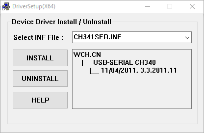
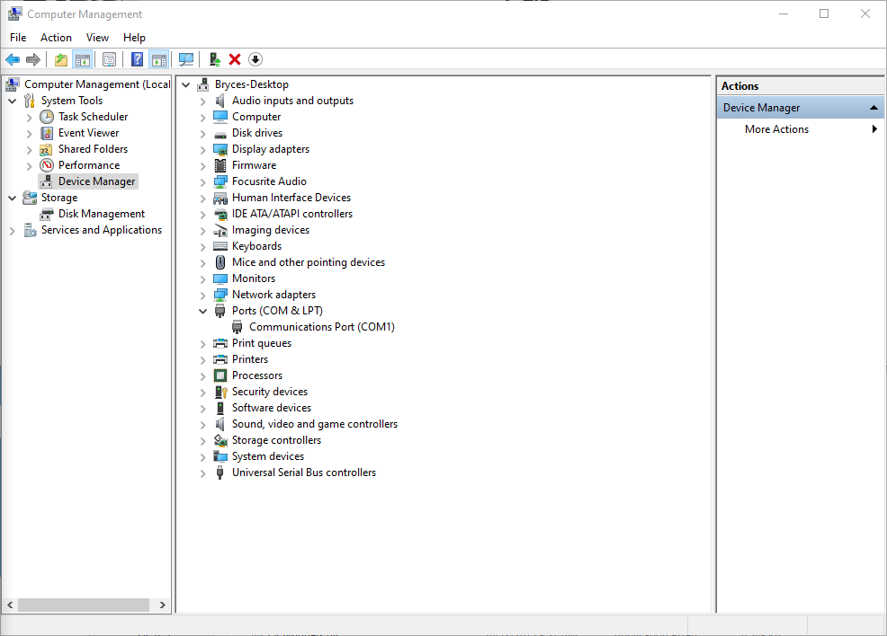
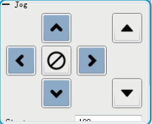

# sainsmart-CNC-instructions
> This is a walkthrough on how to use the Sainsmart CNC Mill in Mr. Yip's classroom. This will include all of the necessary files and instructions to operate the mill and start generating your own GCode.
*There are two ways of operating the CNC and both are covered below
## Table of Contents
* [Operating with Computer](#operating-with-computer)
* [Offline Controller](#offline-controller)
* 
* 
* 
* 
* 
* 

# Operating with Computer
> This will walk you throught the setup on a computer to start CNC milling!
## Downloads
1. Download the [Sainsmart Original Documentation & Files](https://docs.sainsmart.com/article/7c20d7zaw3-how-to-install-candle-grblcontrol-for-windows)
2. Extract the CD.zip file with an extraction tool such as [WinZip](https://www.winzip.com/win/en/) or [7-Zip](https://www.7-zip.org/)
3. Open the extracted CD folder and navigate to `CD > 3018-PROVer Tutorial_Software_Driver > Driver` and run the *Driver_CH340SER.EXE* to install the drivers:

4. Close the window and navigate to `CD > 3018-PROVer Tutorial_Software_Driver > Grblcontrol(Candle_1.1.7)`; run the *Grblcontrol (Candle).exe* file
5. Boom you now have everything you need to start the CNC mill!

## Starting the CNC Mill
1. Plug in the computer that will be running the GCode with the attatched USB cable and power on the CNC
2. On your computer, press the `Windows Key`, search "Computer Management", and select the first option: 

3. Under Device Manager, you will see a `Ports (COM & LPT)` dropdown; here you will see the COM number of the CNC... remember this

4. In the `Candle` program, navigate to `Service > Settings` in the top left
5. Input the COM number that you memorized earlier and press `OK`
6. Your computer is now connected! (in the console, you should see something like [CTRL + X] which indicates a connection)

## Milling
1. To import GCode, press `File > Open` in the top left and select the GCode that you want to run

*There is some test GCode in `CD > 3018-PROVer Tutorial_Software_Driver > Gcode` that you can try*

2. Now insert a drill bit into the chuck of the mill making sure that it is tightly secured with the included wrenches
3. You will now want to line up the bit to where you would like the GCode to start using the on screen buttons

*When aligning the drill bit, you will want to put the bit touching the work surface*

Step = how far the mill moves (for small movements use 1-10)

Feed = how fast the mill moves (1000 is fine)

4. Once aligned, home the mill with these two buttons:

5. You can now press `send` on the bottom of the window to start the milling process

*Do not be afraid to press pause or abort because you think there is something wrong*

6. Odds are you probably need to change the feed rate or the spindle speed of the mill after your initial run...
To do this, you will want to click on the GCode where you see either `F###` or `S###`;

F = Feed Rate

S = Spindle Speed

Simply change the numbers after the corresponding letter to adjust the speeds and resend the GCode

6. Once you are happy with the settings then let the mill do its thing!
